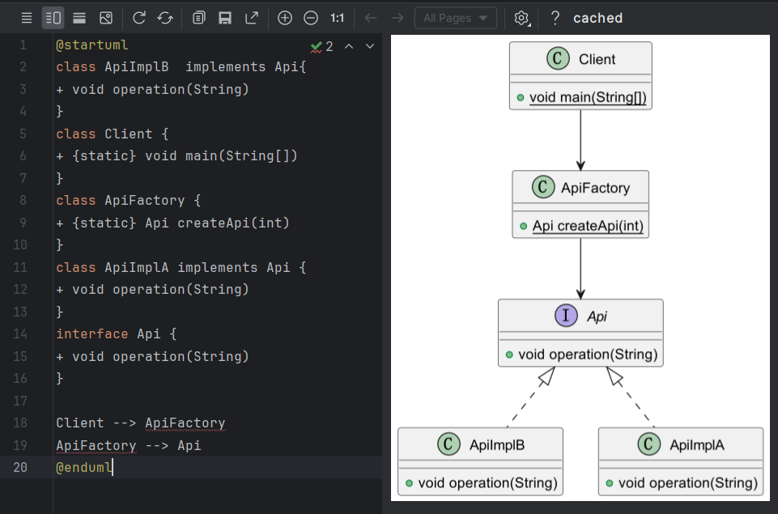
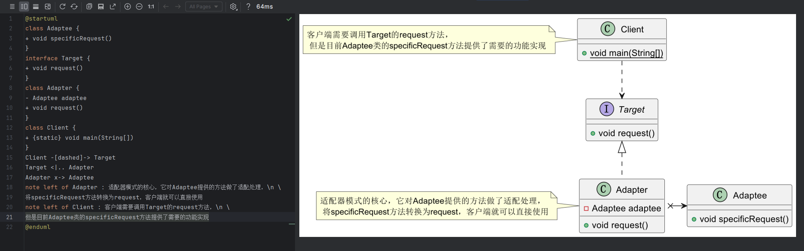
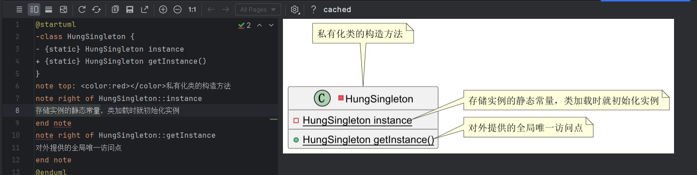
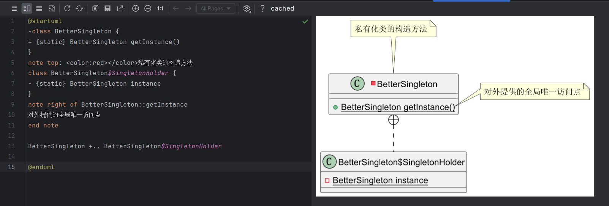
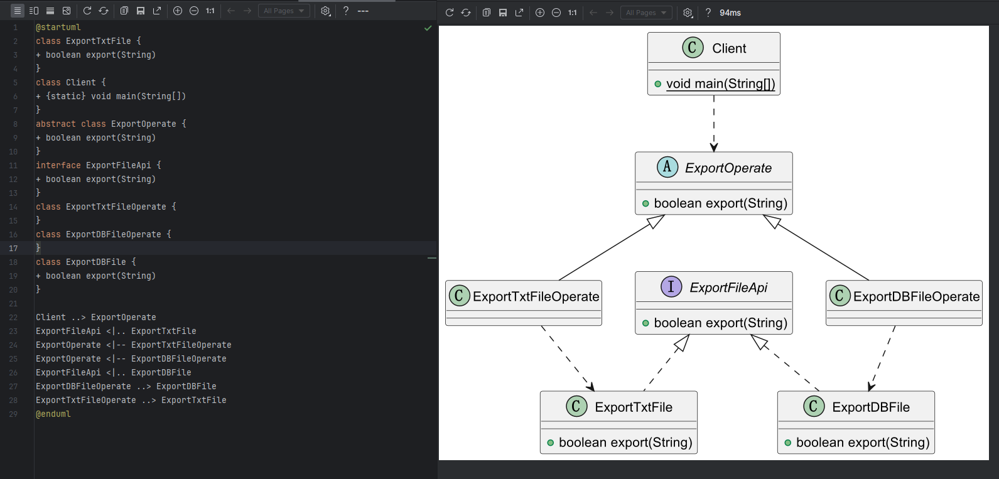

# 研磨设计模式笔记

## 写在前面的一些“废话”

**接口的思想就是“封装隔离”**。

面向接口编程是java编程中的一个重要原则。

三层架构：表现层、逻辑层、数据层。

编程是一门技术，更加是一门艺术。

抽象是对对象的某些能力进行抽象，接口是对行为进行抽象

## 1. 简单工厂模式

### 概念定义

​	简单工厂模式（Simple Factory）：提供一个创建对象实例的功能，而无需关心其具体实现。被创建实例的类型可以是接口、抽象类、也可以是具体的类。其内部**主要实现的功能是“选择合适的实现类”**。

​	简单工厂不是一个标准的设计模式，但是它实在是太常用了，简单而又神奇，所以需要好好掌握它。

### 应用场景

- 如果想要完全封装隔离具体实现，让外部只能通过接口来操作封装体，那么可以选用简单工厂，让客户端通过工厂来获取相应的接口，而无需关心具体的实现。
- 如果想要把对外创建对象的职责集中管理和控制，可以选用简单工厂，一个简单工厂可以创建很多的、不相关的对象，可以把对外创建对象的职责集中到一个简单工厂来，从而实现集中管理和控制。

### 代码示例

#### 接口与实现类

```java
/**
 * 接口的定义
 *
 * @author YinQin
 * @version 1.0.0
 * @createDate 2023年11月28日
 * @since 1.0.0
 */
public interface Api {
    public void operation(String s);
}

/**
 * 接口api的实现类A
 *
 * @author YinQin
 * @version 1.0.0
 * @createDate 2023年11月28日
 * @since 1.0.0
 */
public class ApiImplA implements Api {
    @Override
    public void operation(String s) {
        System.out.println("ApiImplA:" + s);
    }
}

/**
 * 接口api的实现类A
 *
 * @author YinQin
 * @version 1.0.0
 * @createDate 2023年11月28日
 * @since 1.0.0
 */
public class ApiImplB implements Api {
    @Override
    public void operation(String s) {
        System.out.println("ApiImplB:" + s);
    }
}
```

#### 工厂

下面是一个静态工厂的示例，在一个静态方法内，通过参考来决定创建Api接口的实例是A还是B

```java
public class ApiFactory {
    public static Api createApi(int condition) {
        if (condition == 1) {
            return new ApiImplA();
        } else if (condition == 2){
            return new ApiImplB();
        } else {
            return null;
        }
    }
}
```

#### 客户端调用Api

```java
public class Client {
    public static void main(String[] args) {
        Api api = ApiFactory.createApi(1);
        if (api != null) {
            api.operation("正在使用简单工厂");
        }
    }
}
```

### PUML图解



## 2. 外观模式

### 概念定义

​	外观模式（Facade）：为子系统中的一组接口提供一个一致的界面，此模式定义了一个高层接口，这个接口使得这一子系统更加容易使用。

外观模式的本质是：封装交互，简化调用。解耦了客户端与子系统的耦合关系，让子系统更容易扩展和维护。让客户端不在需要了解系统内部的实现。

### 应用场景

- 如果希望为一个复杂的子系统提供一个简单接口的时候，可以考虑使用外观模式。使用外观对象来实现大部分客户需要的功能，从而简化客户的使用。
- 如果想要让客户程序和抽象类的实现部分松散耦合，可以考虑使用外观模式，使用外观对象来将这个子系统与它的客户分离开，从而提高子系统的独立性和可移植性。
- 如果构建多层结构的系统，可以考虑使用外观模式，使用外观对象作为每层的入口，这样可以简化层与层之间的调用，也可以松散层次之间的依赖关系。

### 代码示例

#### 接口与实现类

```java
/**
 * A模块的接口
 *
 * @author YinQin
 * @version 1.0.0
 * @createDate 2023年11月29日
 * @since 1.0.0
 */
public interface AModuleApi {
    public void testA();
}

/**
 * A模块接口的实现类
 *
 * @author YinQin
 * @version 1.0.0
 * @createDate 2023年11月29日
 * @since 1.0.0
 */
public class AModuleApiImpl implements AModuleApi {
    @Override
    public void testA() {
        System.out.println("现在在A模块中操作testA方法");
    }
}

/**
 * B模块的接口
 *
 * @author YinQin
 * @version 1.0.0
 * @createDate 2023年11月29日
 * @since 1.0.0
 */
public interface BModuleApi {
    public void testB();
}

/**
 * B模块接口的实现类
 *
 * @author YinQin
 * @version 1.0.0
 * @createDate 2023年11月29日
 * @since 1.0.0
 */
public class BModuleApiImpl implements BModuleApi {
    @Override
    public void testB() {
        System.out.println("现在在B模块中操作testB方法");
    }
}

/**
 * C模块的接口
 *
 * @author YinQin
 * @version 1.0.0
 * @createDate 2023年11月29日
 * @since 1.0.0
 */
public interface CModuleApi {
    public void testC();
}

/**
 * C模块接口的实现类
 *
 * @author YinQin
 * @version 1.0.0
 * @createDate 2023年11月29日
 * @since 1.0.0
 */
public class CModuleApiImpl implements CModuleApi {
    @Override
    public void testC() {
        System.out.println("现在在C模块中操作testC方法");
    }
}
```

#### 外观类

```java
/**
 * 外观对象
 * @author YinQin
 * @version 1.0.0
 * @createDate 2023年11月29日
 * @since 1.0.0
 */
public class Facade {

    public void test() {
        AModuleApi a = new AModuleApiImpl();
        a.testA();
        BModuleApi b = new BModuleApiImpl();
        b.testB();
        CModuleApi c = new CModuleApiImpl();
        c.testC();
    }
}
```

#### 客户端调用

```java
/**
 * 客户端
 *
 * @author YinQin
 * @version 1.0.0
 * @createDate 2023年11月29日
 * @since 1.0.0
 */
public class Client {
    public static void main(String[] args) {
        // 当我们不能直接修改这三个模块
        // 当我要连续调用ABC三个模块的提供的方法进行测试时
        // 此时的调用方法是这样的
        // new AModuleApiImpl().testA();
        // new BModuleApiImpl().testB();
        // new CModuleApiImpl().testC();
        // 如果我们使用外观模式，将这三个模块包装起来
        new Facade().test();
    }
}

```

### PUML图解


## 3.适配器模式

### 概念定义

​	适配器模式（Adapter）：将一个类的接口转换成客户希望的另一个接口。适配器模式使得原本由于接口不兼容而不能一起工作的那些类可以一起工作。

​	适配器模式的本质是：转换匹配，复用功能。

### 应用场景

- 如果你想要使用一个己经存在的类，但是它的接口不符合你的需求，这种情况可以使用适配器模式，来把己有的实现转换成你需要的接口。
- 如果你想创建一个可以复用的类，这个类可能和一些不兼容的类一起工作，这种情况可以使用适配器模式，到时候需要什么就适配什么。
- 如果你想使用一些己经存在的子类，但是不可能对每一个子类都进行适配，这种情况可以选用对象适配器，直接适配这些子类的父类就可以了。

### 代码示例

#### **接口**

```java
/**
 * 已经存在的接口实现，这个接口需要被适配
 *
 * @author YinQin
 * @version 1.0.0
 * @createDate 2023年11月29日
 * @since 1.0.0
 */
public class Adaptee {
    public void specificRequest() {
        System.out.println("实现了XXX功能");
    }
}
```

```java
/**
 * 定义客户端使用的接口，与特定领域相关
 *
 * @author YinQin
 * @version 1.0.0
 * @createDate 2023年11月29日
 * @since 1.0.0
 */
public interface Target {
    public void request();
}
```

#### 适配器

```java
/**
 * 接口适配器
 *
 * @author YinQin
 * @version 1.0.0
 * @createDate 2023年11月29日
 * @since 1.0.0
 */
public class Adapter implements Target {

    private final Adaptee adaptee;

    public Adapter(Adaptee adaptee){
        this.adaptee = adaptee;
    }

    @Override
    public void request() {
        adaptee.specificRequest();
    }
}
```

#### 客户端

```java
/**
 * 使用适配器的客户端
 *
 * @author YinQin
 * @version 1.0.0
 * @createDate 2023年11月29日
 * @since 1.0.0
 */
public class Client {

    public static void main(String[] args) {
        // 创建需要被适配的对象
        Adaptee adaptee = new Adaptee();
        // 通过适配器获取到客户端需要调用的接口对象
        Target target = new Adapter(adaptee);
        // 调用方法
        target.request();
    }
}
```


### PUML图解



## 4. 单例模式

### 概念定义

单例模式（Singleton）：保证一个类仅有一个实例，并提供一个访问用它的全局访问点。

单例模式的本质是：控制实例数目。

单例模式有两种公认的实现方式，饿汉式和懒汉式。

### 饿汉式

饿汉式：通常是在类创建的时候就已经把类的实例化对象创建好了。它是典型的空间换时间，类加载过程中就已经把类实例化完毕。

#### 代码示例

```java
/**
 * 饿汉式单例模式实现
 *
 * @author YinQin
 * @version 1.0.0
 * @createDate 2023年11月29日
 * @since 1.0.0
 */
public class HungSingleton {

    private static final HungSingleton instance = new HungSingleton();


    /**
     * 私有化构造方法
     */
    private HungSingleton() {}

    /**
     * 全局唯一的访问点，直接返回已经初始化好的实例
     * @return  单例对象
     */
    public static HungSingleton getInstance() {
        return instance;
    }
}
```

#### PUML图解



### 懒汉式

懒汉式：只有在用的时候才去创建，具有延时加载、缓存的特点。它是典型的时间换空间，使用时才会去实例化，同时缓存实例化后的对象，不加同步锁的懒汉式是线程不安全的。

```java
/**
 * 饿汉式单例模式实现
 *
 * @author YinQin
 * @version 1.0.0
 * @createDate 2023年11月29日
 * @since 1.0.0
 */
public class LazySingleton {

    /**
     * 定义一个变量来存储创建好的实例，用它来缓存实例，不用重复创建
     */
    private static LazySingleton instance = null;


    /**
     * 私有化构造方法
     */
    private LazySingleton() {}

    /**
     * 全局唯一的访问点
     * 使用synchronized来保证该方法的线程安全
     * @return  单例对象
     */
    public static synchronized LazySingleton getInstance() {
        // 判断存储实例的变量是否有值
        if (instance == null) {
            // 如果没有则创建，并且赋值给缓存变量
            instance = new LazySingleton();
        }
        return instance;
    }
}
```

#### PUML图解


### 更好的实现方式

```java
/**
 * 更好的单例模式实现
 *
 * @author YinQin
 * @version 1.0.0
 * @createDate 2023年11月29日
 * @since 1.0.0
 */
public class BetterSingleton {

    /**
     * 私有化构造方法
     */
    private BetterSingleton() {}

    /**
     * 静态内部类，只有被调用时才会被装载，从而实现延时加载
     */
    private static class SingletonHolder {
        /**
         * 静态初始化单例对象，由JVM来保证线程安全
         */
        private static final BetterSingleton instance = new BetterSingleton();
    }

    /**
     * 全局唯一的访问点，此方法会初始化内部类SingletonHolder
     * 这样做的好处是既实现了懒加载，又实现了线程安全，还保证了性能
     * @return  单例对象
     */
    public static BetterSingleton getInstance() {
        return SingletonHolder.instance;
    }
}
```

#### PUML图解



### 应用场景

当需要控制一个类的实例只能有一个，而且客户只能从一个全局访问点访问它时，可以选用单例模式。

注：spring IOC容器就是一个单例容器，它里面的所有bean都是单例的。

## 5. 工厂方法模式

### 概念定义

​	工厂方法模式（Factory Method）：定义一个用于创建对象的接口，让子类决定实例化哪一个类，工厂方法模式使一个类的实例化延时到其子类。

工厂方法模式克服了简单工厂违背开放封闭原则的缺点，又保持了封装对象创建过程的优点。但它的缺点是每增加一个产品，就需要加一个产品工厂的类。

### 应用场景

- **重复代码 :** 创建对象 需要使用 大量重复的代码 ;
- **不关心创建过程 :** 客户端 不依赖 产品类 , 不关心 实例 如何被创建 , 实现等细节 ;
- **创建对象 :** 一个类 通过其 子类 来 指定 创建哪个对象 ;

### 代码示例

#### 产品

```java
/**
 * 导出的文件对象的接口
 *
 * @author YinQin
 * @version 1.0.0
 * @createDate 2023年11月30日
 * @since 1.0.0
 */
public interface ExportFileApi {

    /**
     * 导出内容为文件
     * @param data 数据
     * @return 是否成功
     */
    public boolean export(String data);
}
```

```java
/**
 * 导出到TXT文本中
 *
 * @author YinQin
 * @createDate 2023年11月30日
 * @since 1.0.0
 */
public class ExportTxtFile implements ExportFileApi {
    @Override
    public boolean export(String data) {
        System.out.println("导出数据" + data + "到文本文件");
        return false;
    }
}
```

```java
/**
 * 导出到DB文件中
 *
 * @author YinQin
 * @createDate 2023年11月30日
 * @since 1.0.0
 */
public class ExportDBFile implements ExportFileApi {
    @Override
    public boolean export(String data) {
        System.out.println("导出数据" + data + "到数据库备份文件");
        return false;
    }
}
```

#### 工厂

```java
/**
 * 导出方式抽象工厂类
 *
 * @author YinQin
 * @createDate 2023年11月30日
 * @since 1.0.0
 */
public abstract class ExportOperate {

    /**
     * 数据导出方法
     * @param data 数据
     * @return 结果
     */
    public boolean export(String data) {
        ExportFileApi api = factoryMethod();
        return api.export(data);
    }

    /**
     * 工厂方法
     * @return 导出方式
     */
    protected abstract ExportFileApi factoryMethod();
}
```

```java
/**
 * DB文件方式导出工厂
 *
 * @author YinQin
 * @createDate 2023年11月30日
 * @since 1.0.00
 */
public class ExportDBFileOperate extends ExportOperate {
    @Override
    protected ExportFileApi factoryMethod() {
        return new ExportDBFile();
    }
}
```

```java
/**
 * TXT文本方式导出工厂
 *
 * @author YinQin
 * @createDate 2023年11月30日
 * @since 1.0.0
 */
public class ExportTxtFileOperate extends ExportOperate {
    @Override
    protected ExportFileApi factoryMethod() {
        return new ExportTxtFile();
    }
}
```

#### 客户端

```java
/**
 * 客户端
 *
 * @author YinQin
 * @createDate 2023年11月30日
 * @since 1.0.0
 */
public class Client {

    public static void main(String[] args) {
        ExportOperate operate = new ExportDBFileOperate();
        operate.export("DDD");
    }
}
```

### PUML图解



## 6. 抽象工厂模式

### 概念定义

​	提供一个常见一系列相关或相互依赖对象的节课，而无需指定它们具体的类。
